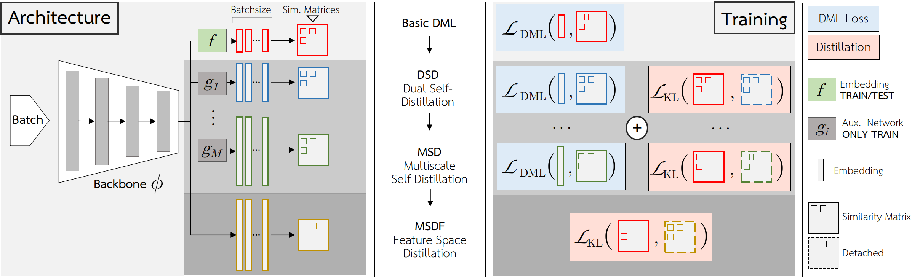
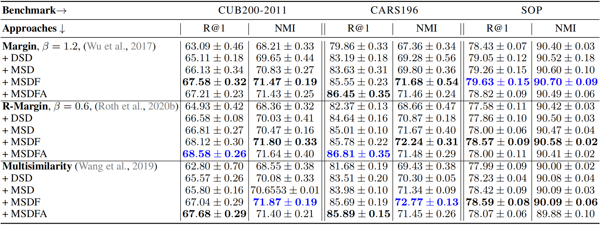
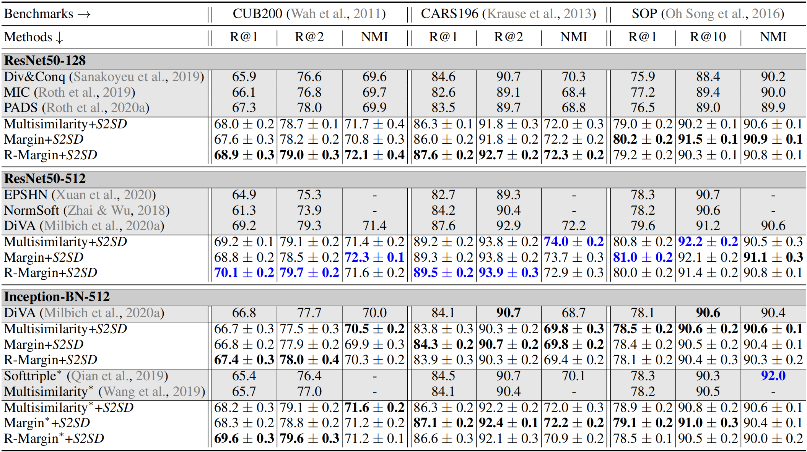

# S2SD - Simultaneous Similarity-based Self-Distillation for Deep Metric Learning

Authors: Karsten Roth, Timo Milbich, Bjoern Ommer, Joseph Paul Cohen, Marzyeh Ghassemi   
**Contact**: karsten.rh1@gmail.com  

*Suggestions are always welcome!*

---
## What is S2SD about?

Simultaneous Similarity-based Self-Distillation, or S2SD for short, is a cheap and easy to use extension for any Deep Metric Learning application:



It learns high-dimensional, better generalizing context during training which it distills into a base embedding space, while also tackling the dimensional bottleneck between feature representations and final embeddings. This significantly improves performance at no additional cost at test time and very little changes in training time. It is especially efficient in boosting very low-dimensional embedding spaces, and easily boosts strong baseline objective to achieve state-of-the-art.

<p align="middle">
  
  
</p>

---
## What can I find in this repo?

The base code in this repo is based on [this repository](https://github.com/Confusezius/Revisiting_Deep_Metric_Learning_PyTorch), which includes implementations and training protocols for various DML objectives. We have integrated S2SD into this repository in the folder `criteria` under `s2sd.py`. Other than that, the majority of the code is the same (with the exception of a checkpointing mechanism related to the `--checkpoint` flag).


---
## How to use S2SD

For general usage instructions for this repo, we refer to the [original repository](https://github.com/Confusezius/Revisiting_Deep_Metric_Learning_PyTorch).

To use S2SD with any DML objective, simply run

```
python main.py --source $datapath --n_epochs 150 --log_online --project <your_project_name> --group <run_name_which_groups_seeds>
--seed 0 --gpu $gpu --bs 112 --loss s2sd --loss_distill_source multisimilarity --loss_distill_target multisimilarity
--loss_distill_T 1 --loss_distill_w 50 --loss_distill_net_dims 512 1024 1536 2048 --loss_distill_match_feats
--loss_distill_feat_w 50 --arch resnet50_frozen_normalize --embed_dim 128 --loss_distill_max_feat_iter 1000
```

Besides basic parameters, S2SD introduces the following new parameters:
```
--loss s2sd

--loss_s2sd_source <criterion>

--loss_s2sd_target <criterion>

--loss_s2sd_T <temperature>

--loss_s2sd_w <distillation weights>

--loss_s2sd_target_dims <dimensions of target branches>

--loss_s2sd_pool_aggr >> Flag; Use global max- & avg. pooling in aux. branches

--loss_s2sd_feat_distill >> Flag; apply feature space distillation

--loss_s2sd_feat_distill_w <feature distillation weight>

--loss_s2sd_feat_distill_delay <activation delay of feature distillation
```


---
## Citations
If you use this repository, please make sure to cite the S2SD paper:
```
bibtex
```

If you use the base code in this repo (and thus of [this repo](https://github.com/Confusezius/Revisiting_Deep_Metric_Learning_PyTorch)), please make sure to also cite the original paper:
```
@misc{roth2020revisiting,
    title={Revisiting Training Strategies and Generalization Performance in Deep Metric Learning},
    author={Karsten Roth and Timo Milbich and Samarth Sinha and Prateek Gupta and Björn Ommer and Joseph Paul Cohen},
    year={2020},
    eprint={2002.08473},
    archivePrefix={arXiv},
    primaryClass={cs.CV}
}
```
